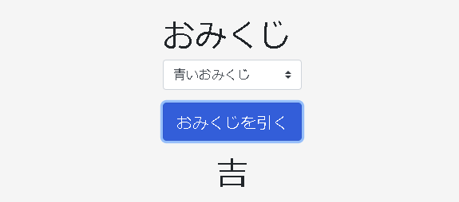

# サンプルアプリ

以下Qiita記事の実装コードとなります。
内容については記事を参照してください。

+ [フォルダでほぼ完結する開発環境を0から整えて実装してみた（Python+VSCocde）](https://qiita.com/pocokhc/items/105368dc33e3cf534540)


# アプリ概要

おみくじを引くだけの簡単なアプリです。
実行するとローカルサーバが起動し、ブラウザで見ることができます。




# ディレクトリ構成

```
.
├─ .vscode
│   ├─ extensions.json  // 拡張機能情報
│   ├─ launch.json      // 実行情報
│   └─ settings.json    // 設定全般の情報
│
├─ setting
│   ├─ setting_test.yml  // ファイル単体やテストを実行時の設定ファイル
│   └─ setting_web.yml  // flask実行時の設定ファイル
│
├─ src  
│   ├─ sample.py  // サンプルコード
│   ├─ common
│   │    └─ utils.py // アプリを通して使えるコード群
│   │
│   ├─ setting
│   │    └─ Setting.py // アプリ共通設定を管理するクラス
│   │
│   ├─ omikuji   // メインコード置き場
│   │    └─ Omikuji.py
│   │ 
│   └─ web  // web側コード置き場
│        ├─ static     // 静的ファイル置き場
│        ├─ templates  // HTMLのテンプレート置き場
│        ├─ index.py  // indexページのサーバ側コード
│        └─ run.py    // Webのスタートポイント
│ 
├─ tests    // テストコード置き場
│   ├─ test_sample.py  // サンプルコード
│   └─ omikuji
│       ├─ test_Omikuji.ipynb
│       └─ test_Omikuji.py
│
├─ hello.ipynb  // サンプルコード
├─ hello.py     // サンプルコード
├─ パッケージ.ipynb  // パッケージ管理ファイル
│
├─ log   // ログ保存場所
├─ tmp   // 一時ファイル置き場
├─ .env  // 環境変数
├─ .gitignore
├─ LICENSE
└─ README.md
```

